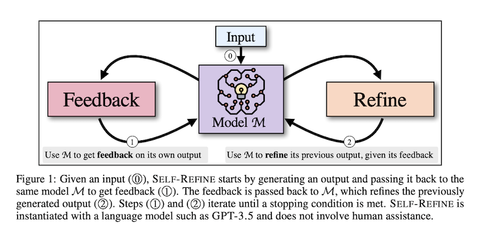

These are my notes from the paper [Self-Refine: Iterative Refinement with Self-Feedback](https://arxiv.org/abs/2303.17651) by Aman Madaan, Niket Tandon, Prakhar Gupta, Skyler Hallinan, Luyu Gao, Sarah Wiegreffe, Uri Alon, Nouha Dziri, Shrimai Prabhumoye, Yiming Yang, Shashank Gupta, Bodhisattwa Prasad Majumder, Katherine Hermann, Sean Welleck, Amir Yazdanbakhsh, Peter Clark.

Describes the [Self-Refine](../../permanent/self-refine.md) approach to [Reflection](../../permanent/reflection.md): LLM generates an output, then provides feedback on its work and refines the output based on that feedback, effectively simulating a human writer's process of editing their work.

The approach is motivated by how humans refine their written text. It does not require supervised training data, additional training, or reinforcement learning.

It uses a single LLM as the generator, refiner, and feedback provider (see [Single-Agent Systems](../../permanent/single-agent-systems.md)).

They evaluate Self-Refine across seven tasks, from dialogue response generation to mathematical reasoning, using GPT-3.5 and GPT-4.

Across all evaluated tasks, outputs generated with SELF-REFINE are preferred by humans and automatic metrics over those generated with the same LLM using conventional one-step generation, improving by ∼20% absolute on average in task performance.
