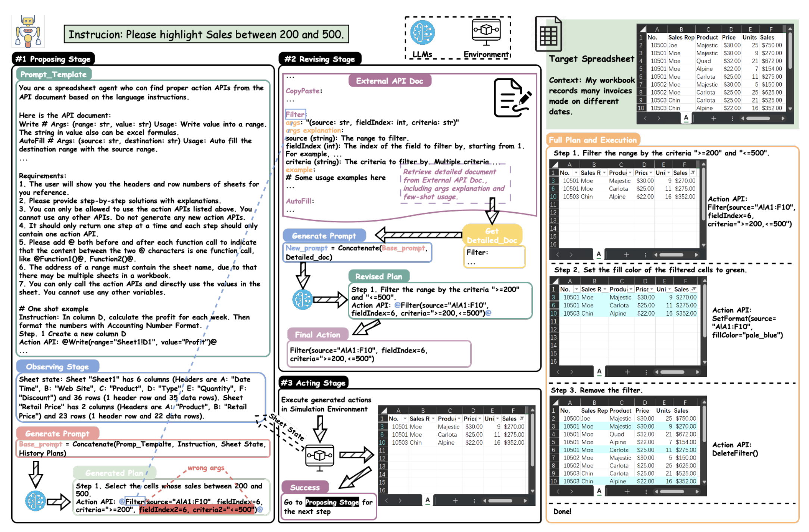

*Notes from "[SheetCopilot: Bringing Software Productivity to the Next Level through Large Language Models](https://arxiv.org/abs/2305.19308)" by Hongxin Li, Jingran Su, Yuntao Chen, Qing Li, Zhaoxiang Zhang*

## Overview

Propose [SheetCopilot Agent](../../permanent/sheetcopilot-agent.md)

Natural language tasks to spreadsheet controls.

Uses [Atomic Actions](../../permanent/atomic-actions.md): an abstraction of spreadsheet software functionalities.

Uses a [state-machine](../../permanent/state-machine.md) Task [Planning](../../permanent/planning.md) framework for LLMs to interact with spreadsheets.

Curate a dataset of 221 spreadsheet control tasks.

Establish an automated evaluation pipeline to benchmark ability of LLMs in software control tasks.

SheetCopilot completes 44.3% of tasks in a single generation, which outperforms code generation baseline.

## 1. Introduction

Being able to control software using natural language is something we've been pursuing for a long time. LLMs appear to be the tool that's going to help us achieve that goal.

Other papers have researched LLMs augmented with tools:

* 24: [ART: Automatic multi-step reasoning and tool-use for large language models](../../permanent/automatic-multi-step-reasoning-and-tool-use-for-large-language-models.md)
* 25: Toolformer: Language models can teach themselves to use tools
* 20: Completing tasks by connecting foundation models with millions of apis
* 26: Solving ai tasks with chatgpt and its friends in huggingface
* 2: Do as i can, not as i say: Grounding language in robotic affordances
* 27: Vipergpt: Visual inference via python execution for reasoning

And reasoning abilities:

* 32: [ReAct: Synergizing Reasoning and Acting in Language Models](../../permanent/react-synergizing-reasoning-and-acting-in-language-models.md)
* 18: [Large Language Models are Zero-Shot Reasoners (May 2022)](large-language-models-are-zero-shot-reasoners-may-2022.md)
* 30: [Chain-of-Thought Prompting Elicits Reasoning in Large Language Models](chain-of-thought-prompting-elicits-reasoning-in-large-language-models.md)
* 31: [MM-REACT Prompting ChatGPT for Multimodal Reasoning and Action](mm-react-prompting-chatgpt-for-multimodal-reasoning-and-action.md)

The ability to have LLMs work alongside existing software tools has not been thoroughly explored.

But we know from papers like Augmented language models: a survey that LLMs that could use existing software tools could unlock massive potential.

The lack of a standardised framework for model-application interaction and lack of comprehensive benchmarks for evaluating performance, has hindered this.

There are a few challenges to get LLMs to play nice with apps:

1. Converting application state and functionality into a text form that can be comprehended by models.
    1. We want a way where we can systematically represent software and interfaces and logic through natural language.
2. Safely allowing models to generate software commands and params: need mechanisms to validate, debug and reject or revise model outputs to stop bad operations or states.
    1. See On the origin of hallucinations in conversational models: Is it the datasets or the models? and Augmenting large-language models with chemistry tools.
3. Giving models the means of monitoring software state changes, exceptions and errors in multi-step tasks to ensure the models respond correctly.

To achieve this, need a diverse dataset that captures "ambiguity of real-world language use".

In addition, enabling LLMs to direct complex software also requires curating datasets that capture the diversity and ambiguity of real-world language use, as well as developing automated techniques to reliably evaluate model performance at scale. See Can large language models be an alternative to human evaluations?

The spreadsheet is a "robust application platform" and therefore a good candidate for investigation of control via natural language.

They propose a general framework for enabling application control via LLM, and an agent they call [SheetCopilot Agent](../../permanent/sheetcopilot-agent.md).


*Figure 1. from SheetCopilot*

As we can see, SheetCopilot understands spreadsheet editing commands in natural language.

It can create step-by-step plans from complex requests, and can issue commands to carry out operations using spreadsheet application.

As well as spreadsheet-manipulating agent, [SheetCopilot Agent](../../permanent/sheetcopilot-agent.md), they propose a dataset of spreadsheet manipulation requests expressed through language, and evaluation framework with automated metrics to assess how accurately models can comprehend requests, devise optimal plans and perform operations through spreadsheet interface, since "robust measurement is key to accelerating progress in this area".

Their agent SheetCopilot achieves substantial capabilities for guiding spreadsheet through natural language.

They generate fully-executable command sequences for 87.3% of problems in the benchmark suite, and produce completely correct solutions for 44.3% of tasks, surpassing the traditional programming approaches by a lot. 

They curate a dataset of 221 representative spreadsheet tasks collected from superuser.com, including verified solutions created by the authors for each task.

They present three primary contributions to the goal of achieving sophisticated interfaces between language models and traditional software apps:

* Generate framework for facilitating model-software interaction along with [SheetCopilot Agent](../../permanent/sheetcopilot-agent.md).
* Create tools for evaluating model and interface performance, including benchmark suite of interactive spreadsheet tasks reflecting real-world requests and a fully automated pipeline for measuring how accurately models comprehend complex software prompts, devise optimal plans and execute operations through the software interface.
* They conduct in-depth assessment benchmarking the abilities of leading LLMs in this challenging domain. They show that LLMs equipped with their method significantly outperform the strong code generation baseline.

## 2. Related Works

### Tool-augmented Large Language Models 

Paper that explored the internalised knowledge of LLMs:
* On the opportunities and risks of foundation models
    
Papers utilising prompt engineering to create steps for household robotic tasks:
* 14: Language models as zeroshot planners: Extracting actionable knowledge for embodied agents
* 3: Do as i can, not as i say: Grounding language in robotic affordances.
* 16: Inner monologue: Embodied reasoning through planning with language models
* 15: Grounded decoding: Guiding text generation with grounded models for robot control
* 8: Palm-e: An embodied multimodal language model

These papers have used *auxiliary* models to "ground LLMs in real world":
* 3:  Do as i can, not as i say: Grounding language in robotic affordances
* 16: Embodied reasoning through planning with language models
* 15: Grounded decoding: Guiding text generation with grounded models for robot control

Trained LLMs via mixing visual-language data and embodied data:
* Palm-e: An embodied multimodal language model

Another promising direction is to connect LLMs with external tools (Toolformer: Language models can teach themselves to use tools)
- such as a web browser: Webgpt: Browser-assisted question-answering with human feedback
- HuggingFace model hub: Solving ai tasks with chatgpt and its friends in huggingface
- chemical software: Chemcrow: Augmenting large-language models with chemistry tools
- PowerPoint: Taskmatrix. ai: Completing tasks by connecting foundation models with millions of apis 
* even a tool library:
    * Art: Automatic multi-step reasoning and tool-use for large language models

All these papers use LLMs to generate Action Sequences which are then parsed into API calls of tools.

This paper is targeted at spreadsheet manipulation - a common demand.

### Natural Language Processing (NLP) for Spreadsheets

Studies that have investigated the feasibility of using NLP methods to guide the manipulation of Excel sheets:
* 12: Interactive programming by natural language for spreadsheet data analysis and manipulation
* 11: Automating string processing in spreadsheets using input-output examples
* 28: Fidex: Filtering spreadsheet data using examples
* 6: Spreadsheetcoder: Formula prediction from semi-structured context.
* 17: Flame: A small language model for spreadsheet formulas

Early work was Flash Fill: which automates string processing tasks using program synthesis by example.

NLyze [12]: Nlyze: Interactive programming by natural language for spreadsheet data analysis and manipulation
- utilizes a translation algorithm to convert a user’s natural language instruction to a ranked set of likely programs.

Inspired by the success of Codex and AlphaCode, one recent study: Flame: A small language model for spreadsheet formulas focused on generating formulas given textual descriptions.

They compared the performance of several state-of-the-art LLMs:
- GPT-3
- T5
found that these models can generate accurate formulas with high efficiency. This study focused on formula generation rather than general sheet control tasks.

In this paper, we aim to address this gap by benchmarking the capability of LLMs for sheet control tasks.

## 3. Dataset and Evaluation

Early research focused on limited subsets of tasks like formula generation and lacked comprehensive, standardised means of evaluation.
* 12: Nlyze: Interactive programming by natural language for spreadsheet data analysis and manipulation
* 6: Spreadsheetcoder: Formula prediction from semi-structured context.
* 17: Flame: A small language model for spreadsheet formulas
    
They made a high-quality evaluation benchmark as a foundation for assessing the spreadsheet control capabilities of LLM-based agents.

Dataset compilation procedure incorporates:
* gathering tasks and worksheets from the Internet
* filtering low-quality or irrelevant tasks
* consolidating redundant entries
* adapting seed tasks
* manually annotating a core set
* The end product is a comprehensive and cleanly-labeled collection of spreadsheet-related tasks.
* We also report statistics and analysis to characterise the dataset properties, guide future work, and set initial baselines.
* Moreover, we develop an automated, reproducible evaluation framework closely tailored to our curated natural language spreadsheet control dataset.
* This enables systematically assessing model abilities, gaining insights into current limitations, and driving continued progress in this domain.

### 3.1 Diverse Seed Task and Workbench Collection

Scrape all questions with spreadsheet-related tags on www.superuser.com and obtain a raw dataset comprising ∼16k question and answer (Q&A) pairs.

Sourcing questions from SuperUser ensures our task dataset is both comprehensive and representative.

Since not every question is a sheet manipulation task, they filter via:
* keyword-based filters
* LLM-based filters
* removing Q&A pairs unrelated to spreadsheet automation, resulting in ~13k pairs.
    
They analyse the distribution of the dataset, by defining six task categories:
* Entry and Manipulation
* Management
* Formatting
* Charts
* Pivot Tables
* Formulas

We label exemplar Q&A pairs with at least one category to prompt the language model to categorize each pair, as pairs may belong to multiple categories.

To identify representative Q&A pairs, we embed and cluster pairs within each unique category combination.

We then choose 67 pairs representing the clustering centers and involving operations supported by our evaluation environment.

The spreadsheet tasks described in these pairs are regarded as the seed tasks which capture the most important patterns of our dataset.

To evaluate LLMs, we also collect 28 real-world spreadsheets as our workbench by:
* 1. downloading practical sheets from the Internet.
* 2. Generating typical daily-use sheets by hand.

These sheets represent common uses such as analysing sales data, calculating financial metrics and visualising data with charts.

### 3.2 Core Set Collection

The seed tasks cannot be directly used since their original sheets differ from the evaluation sheets. We propose collecting a core dataset by adapting and simplifying the seed tasks to bridge this gap.

Adaptation. Inspired by [Self-Instruct: Aligning Language Models with Self-Generated Instructions](../../permanent/self-instruct-aligning-language-models-with-self-generated-instructions.md), we prompt an LLM to adapt the seed tasks according to the detailed descriptions of the evaluation sheets.

Specifically, GPT-4 is prompted to change the manipulated elements in the seed tasks to generate new tasks compatible with the evaluation sheets.

For instance, GPT-4 can change the data types required to be set or ranges to be modified in the original seed task.

In this step, 1669 new task instructions are generated (See Tab. D for examples).

Simplification. The adaptations are likely to mention specific formulas and operations.

To address this issue, we prompt an LLM to simplify each task by replacing specific expressions with natural spoken language so that the task instruction reads like the fashion of a non-expert user.

This step reduces the average token length from 47.1 to 33.81.

### 3.3 Task Evaluation by Execution

It is hard to evaluate solutions generated by LLMs through verbatim comparison, as it is likely that multiple solutions can successfully complete a task.

A viable approach is assessing whether the final sheet state after executing the solution meets the task instruction.

We only assess the necessary properties required for the ground truth spreadsheet’s operation

For example, in the task "Plot a line chart with the X-axis showing the week and the Y-axis showing sales", we only consider properties related to the chart, ignoring other aspects.

To assess an LLM-generated solution, we evaluate the consistency of the necessary properties between the spreadsheet resulting from executing this solution and the ground truth spreadsheet in our evaluation environment.

 If the necessary properties of the resulting spreadsheet fully match any potential ground truth candidate, the associated solution is deemed correct.

## Method

Inputs spreadsheets and user tasks as plain English, and generates a plan to modify the spreadsheet.

Example of [In-Context Learning](../../permanent/in-context-learning.md), aka solve the problem through [Prompt Engineering](../../permanent/prompt-engineering.md).

The core concepts:

- 1. [Atomic Actions](../../permanent/atomic-actions.md)
    - abstraction of spreadsheet software functionalities.
    - set of virtual APIs representing common spreadsheet functions.
- 2. State Machine-Based Task Planner
    - handles "multi-turn interaction between the language models and the spreadsheets"

Combined they allow them to control spreadsheets with natural language.
###  Prompting LMs as a SheetCopilot

#### Prompt Template

Start with **General role description**. Here, the [Role (Prompt Engineering)](../../permanent/role-prompt-engineering.md) serve as an anchor for enabling language models to understand the context. 

```text
You are a spreadsheet agent who can find proper action APIs from the API document based on language instructions.
```

Provide [Atomic Actions](../../permanent/atomic-actions.md). Aka the API docs.

Provide the LMs with the interface information needed for task planning.

```text
Here is the API document:
Write # Args: (range: str, value: str) Usage: Write value into a range. The string in value also can be Excel formulas.
AutoFill # Args: (source: str, desctination: str) Usage: Auto fill the desctination range with the source range.
...
```

Set of Output Requirements

Show the format required.

```text
Requirements:
1. The user will show you the headers and row numbers of sheets for your reference.
2. Please provide step-by-step solutions with explanations.
3. You can only be allowed to use the action APIs listed above. You cannot use any other APIs. Do not generate any new actions APIs.
4. It should only return one step at a time and each step should only vontain one action API.
5. Please add @ both before and after each function call to indicate that the content between the two @characters in one function call like @Function1()@, Function2()@.
6. The address of a range must contain the sheet name, due to that there may be miultiple sheets in a workbook.
7. You can only call the actions APIs and directly use the values in teh sheet. You annot use any other variables
```

Show Multi-round interaction example between a user and an assistant.

```text
# One shot example
Instruction: In column D, calculate the profit for each week. Then format the numbers with Accounting Number Format.
Step 1. Create a new column D
Action API: @Write(range="Sheet1!D1", value="Profit")@
```


The output requirement tells LMs how to generate texts that can be programmatically extracted and executed.

The multi-round example hints LMs how the observe-propose-revise-act loop appears and improves the overall planning quality.

### Atomic Action as A Bridge for LMs and Software

State-of-the-art LMs have shown the superb ability to generate detailed plans for
- household tasks [16]
- software control [20]
- debugging [5].

However, the generated plans are in natural language which is easy for humans to read but not directly admissible for machine execution.

To overcome the limitation mentioned above, we propose to model the functionalities of existing spreadsheet software as a set of virtual APIs called atomic actions

An atomic action is comprised of:
- an API name
- a typed argument list
- a usage document string
- several usage examples.

These atomic actions can be implemented on different spreadsheet platforms.

The example implementations in Tab. H of the appendix show that the atomic actions involve cell value modification, formatting, sheet management, formula and functions, charts, and pivot tables.

Choosing proper atomic action granularity is crucial, as actions must be expressive yet concise to fit in the LM context windows.

We determine our atomic actions as follows:

1) Extract all actions involved in the top SuperUser spreadsheet Q&As
2) Embed and cluster the extracted actions into candidates
3) Select the minimum set of actions covering all the tasks we collected in Sec. 3.1.

### Relation to Agents Generating VBA Codes

LMs are also capable of generating machine-readable codes [5].

This approach is especially tempting for Microsoft Excel as it comes with an embedded script language called Visual Basic for Applications(VBA). 

However, the code generation approach faces challenges from both the LMs side and the spreadsheet software side.

On the code LMs side, the existing training corpus [10, 13, 5] for code LMs hardly contains VBA source files as it is only a niche programming language compared with C++ or Python

 On the spreadsheet software side, software such as Google Sheets, Libre Office, and WPS either do not support VBA at all (Google Sheets) or only support a limited subset of VBA functions (Libre Office and WPS).

Therefore, we advocate a more software-agnostic approach that does not rely on embedded programming language support.

### State Machine-based Task Planning

Complicated enough spreadsheet tasks need > 10 steps.

* [Open-loop Planning](../../permanent/open-loop-planning.md)
    * Directly generating a complete task plan from the instruction.
    * Pros
        * Architecturally easier.
    * Cons 
        * Exponentially harder as steps increase.
        * Each step changes the sheet state.
            * Correct step $T + 1$ relies on perfectly understanding how the sheet state changes after the previous T steps.
* Alternative?
    * Propose a State Machine-Based Task Planner which revises the plan according to feedback from either LMs or software.
    * Example of [Closed-loop Planning](../../permanent/closed-loop-planning.md)
        
* Our planner is divided into 4 stages: observing, proposing, revising and acting stages:
    * Observing Stage
        * In this stage, they add a description of the sheet state to the query, including:
            * name of each column
            * total number of rows
                * this allows LMs to determine atomic action arguments..
        * This allows LMs to generate solutions in a closed-loop manner by observing the previous actions’ consequences without implicitly modeling sheet states.
    * Proposing Stage
        * Concatenate:
            * system prompt P
            * initial task instruction I
            * the sheet state $S_t$
            * planning history $H_t$
        * Then, ask to plan the next atomic action $A_t+1$.
        * Do validate:
            * Check response $R_t$ from language model, to ensure it's admissible command ("atomic action").
            * $A_t+1 = Validate(R_t+1) = Validate(LanguageModel(P, I, S_t, H_t))$. 
            * Error: go to Revising stage
                * missing the format requirement
                    * try again.
                * hallucinating undefined actions
                    * try again.
                * incorrectly determining action parameters.
                    * in this case, include the docs.
    * Revising Stage
        * Two ways are adopted to revise a proposed atomic action:
            * feedback-based one and a retrieval-based one
        * Feedback-based
            * revision utilises the error feedback from both the atomic action validation and the spreadsheet software execution. 
                * For example, if the atomic action validating step detects a hallucinated atomic action, a new prompt will be created to inform the LM of this error and to ask it to reiterate the available atomic actions.
            * Retrieval-based
                * Supply the LM with detailed external knowledge that does not fit in the system prompt due to the context window limit. 
                * For example:
                    * if the LM uses an atomic action with wrong arguments, a detailed document containing the argument descriptions and usage examples of this action is provided in the new prompt to enhance the probability of the LM correctly determining the atomic action arguments. This process resembles how a human programmer behaves when encountering less familiar APIs.
        * Special case:
            * A special case in the revision stage is that after being supplied with more information about the initially proposed atomic action, the LM suddenly finds that it has chosen a wrong action and decides to return to the revising stage.
    * Acting Stage
        * After the proposing and revising stages, the atomic action $A_t+1$ is submitted to the spreadsheet software for execution: $S_{t + 1} = \text{SpreadSheetEnv}(A_{t+1}, S_{t})$
        * We update the planning history $H_t$ if the execution succeeds: $H_{t+1} = H_t \cup {A_t+1, S_t+1}$.
        * If the software reports a run-time error, the state machine will return to the proposing stage to prompt

### Hallucination Mitigation

* Output Formatting Checks
    * The underlying functions of atomic actions require precisely formatted planning results. 
    * However, we found that LLMs probably generate semantically correct yet inadmissible action plans as shown in Fig. 1.
    * They wrap actions with special tokens (e.g. `@`) and detect the tokens in the output to check whether the output is correctly formatted.
    * Therefore, we require LMs to wrap actions with special tokens (e.g. @) and detect the tokens in the output to check whether the output is correctly formatted.
* Atomic Action Disambiguation
    * The internalized knowledge in LMs is likely to be confused with the atomic action definitions in the document.
    * Due to this conflict, LMs are prone to self-delusion, which means that it hallucinates undefined actions or adds illegal action arguments [23, 14].
    * To tackle this problem, the atomic action names are substituted with a set of synonyms that are far away from the official names in an embedding space. For instance, Write and SetConditionalFormat are substituted with RangeInputValue and FormatWithRules, respectively (See the details in the appendix).

## 5. Experiments

The goals of our experiments are threefold:

(i) compare representative LLMs on the proposed dataset.
(ii) demonstrate that the proposed method improves the success rate and efficiency over a simple baseline;
(iii) show the flexibility and stability of our method.

### 5.1 Benchmark Protocol

- Dataset
    - The **221** tasks introduced in Sec. 3.2 are used to conduct the following experiments.
- Metrics
    - `Exec@1` measures the proportion of solutions executed without throwing exceptions
    - `Pass@1` is used to evaluate functional correctness [5].
- Models
    - We adopt leading large language models with public API access, including GPT-3.5-Turbo/GPT-4 from OpenAI and Claude v1 from Anthropic.
    - Details of the models and hyper-arguments used for generation could be found in the appendix.
