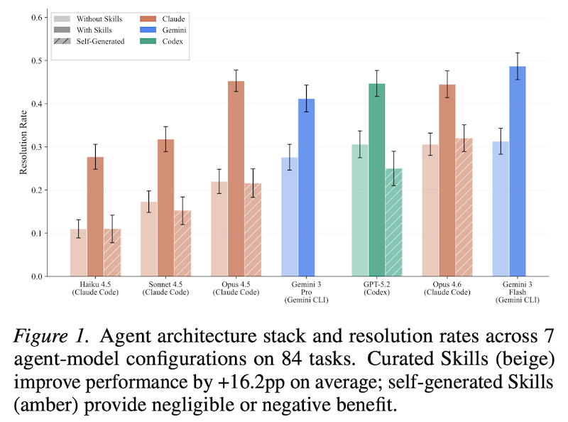

[Agent Skills](../../permanent/agent-skills.md) are structured packages of Markdown files and scripts that augment [AI Agents](../../permanent/ai-agents.md)' capabilities. They usually look something like this:

```
~/.claude/skills/some-skill/
├── SKILL.md
└── scripts/
    └── some_script.py
```

They were first introduced as a feature of the Claude ecosystem around October 2025 [^1], and have recently exploded in popularity, thanks to [OpenClaw](../../permanent/openclaw.md) and friends.

Despite a lot of benchmarks existing to measure agentic AI capability, none so far have been created solely for the purpose of measuring the efficacy of skills, including how and when to use them, and what differentiates good skills from bad ones. That's where the paper [*SkillsBench: Benchmarking How Well Agent Skills Work Across Diverse Tasks*](https://arxiv.org/abs/2602.12670) by Li et al. (Feb 2026) comes in. [^2]

In the paper, they describe their [SkillsBench](../../permanent/skillsbench.md) benchmark of 84 tasks across 11 domains. Each task in the benchmark is tested under 3 conditions:

- no skills
- curated skills
- self-generated skills - that is, skills entirely created from the LLM's own knowledge. 

The skills themselves were pulled from GitHub, community marketplaces, and corporate partners, with around 47k skills tested as part of the collection.

Probably, the most important finding is that self-generated skills provide no benefit on average, suggesting that models cannot reliably author procedural knowledge.

They also demonstrate that curated skills raise the pass rate by an average of 16.2 percentage points, but the effects vary by domain. Skills help most when tasks require concrete procedures like specific steps, constraints, and sanity checks, rather than conceptual knowledge. Gains are largest on specialised workflows or brittle formats, and smallest when models already have strong priors.

Focused skills with 2–3 modules outperform comprehensive documentation, and smaller models with skills can match larger models without them.

They test a number of different LLMs with their corresponding agent harness and find that Gemini performed best overall, but skills had the greatest impact on the Claude Code user, which I guess makes sense since Anthropic created skills in the first place and probably has the greatest lead with their models fine-tuning to use skills. Codex CLI showed competitive raw performance, but it frequently neglects the provided skills. Agents acknowledge the skill content but often implement solutions independently. I suspect Codex will improve at skill utilisation in future versions as OpenAI refines its implementation.



The paper provides a concrete definition of a skill, contrasting it with other agentic paradigms like [Few-Shot Examples](../../permanent/few-shot-examples.md), [Retrieval Augmented Generation](../../permanent/retrieval-augmented-generation.md) and [Tool Documentation](../../../../permanent/tool-documentation.md).

According to the paper, a Skill is an artifact that satisfies four criteria:

- **Procedural**: It teaches *how* to do something (workflows, step-by-step procedures) rather than just stating facts
- **General**: It applies to a category of problems, not just one specific instance
- **Structured**: It includes a `SKILL.md` file and can bundle supporting resources like scripts, templates, or examples
- **Portable**: It lives entirely in the filesystem, making it easy to edit, version control, share, and use across different agent harnesses

The paper draws a nice analogy to computing paradigms: foundation models provide base capabilities (like CPUs), agent harnesses orchestrate context and tools (like operating systems), and skills extend competence to specialised domains (like applications).

In my own work, I've been finding a lot of success recently by adding skills to our project. They tend to be really useful for guiding the LLM on how to run the test suite and evals effectively, how to check for common issues across the codebase, and even parse logs and debug common customer issues. Any time I find myself repeatedly performing a cumbersome sequence of steps, turning it into a Skill pays dividends pretty quickly. They're just docs and convenience scripts at the end of the day. Not exactly a brand new paradigm for software engineers.

Related articles:

- My current OpenClaw setup: [OpenClaw: the missing piece for Obsidian's second brain](../../permanent/openclaw-the-missing-piece-for-obsidians-second-brain.md)
- Another article on AI-Assisted Development best practices: [Spec-First LLM Development](../../permanent/spec-first-llm-development.md)

[^1]: Introducing Agent Skills. (n.d.). Claude. Retrieved February 23, 2026, from https://claude.com/blog/skills
[^2]: Li, X., Chen, W., Liu, Y., Zheng, S., Chen, X., He, Y., Li, Y., You, B., Shen, H., Sun, J., Wang, S., Zeng, Q., Wang, D., Zhao, X., Wang, Y., Chaim, R. B., Di, Z., Gao, Y., He, J., … Lee, H. (2026). *SkillsBench: Benchmarking How Well Agent Skills Work Across Diverse Tasks* (Version 1). arXiv. https://doi.org/10.48550/ARXIV.2602.12670
