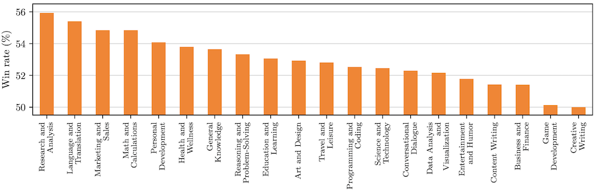
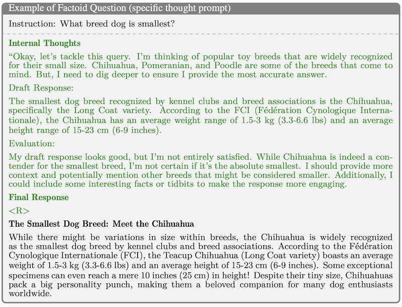
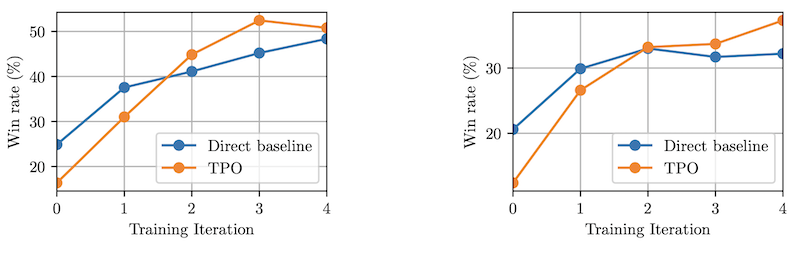
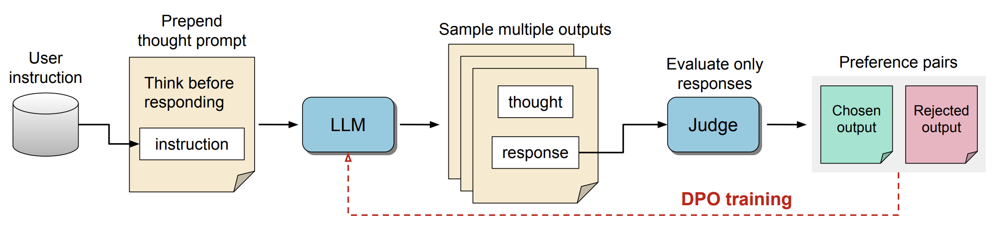

*These are my notes from the paper [Thinking LLMs: General Instruction Following with Thought Generation](https://arxiv.org/abs/2410.10630) (Oct 2024) by Tianhao Wu, Janice Lan, Weizhe Yuan, Jiantao Jiao, Jason Weston and Sainbayar Sukhbaatar.*

## Overview

This paper introduces [Thought Prompting](../../permanent/thought-prompting.md), a prompting method that enables LLMs to engage in a "thinking" process before generating responses. Within the [Agentic Reasoning](../../permanent/agentic-reasoning.md) framework, it would be considered a [Planning](../../permanent/planning.md) technique.

Unlike Chain-of-Thought prompting, which mainly benefits math and logic tasks, Thought Prompting improves results across many tasks.

*Fig 4: Fine-grained evaluation on unseen instructions from UltraFeedback, broken down by category. They measure the win rate of TPO against the direct baseline as judged by GPT4.*

The method separates the thought process from the final answer, enabling developers to choose whether to display the thought process for interpretability or keep it hidden. For example, in Fig 6, you can see the response is separate from the thoughts using the `<R>`; this works similarly to o1-preview, which also hides its internal thought process.

*Fig 6: Example of TPO answering a simple factoid question. This model is trained with the specific thought prompt, so it writes a draft and evaluates it in the thought part.*

The downside is that it relies on fine-tuning - it doesn't benefit "thoughtless" models. As shown in Fig 3, adding Thought Prompting to an untrained model worsens results.

*Fig 3: Training iterations on AlpacaEval and Arena-Hard, comparing their TPO method to direct baseline starting from the seed.**

### Thought Prompt Optimisation

The paper introduces [Thought Policy Optimisation](../../permanent/thought-policy-optimisation.md) (TPO), a fine-tuning technique based on Direct Preference Optimisation (DPO). TPO uses a Judge model to evaluate model outputs based solely on the responses, without access to the thought process; this lets the model learn and refine its "thinking" abilities without relying on supervised thought data, asshowne in the diagram below.

*Figure 1: Thought Preference Optimisation: they start by prompting the LLM to generate thoughts before its response. After sampling different outputs, we feed the response parts to the judge model which determines the best and worst ones. Then, they use the corresponding full outputs as chosen and rejected pairs for DPO optimisation. They perform multiple iterations of this training.*

Gets top 3 in AlpacaEval (52.5%) and performs on par with GPT4 in Arena-Hard (37.3%)
