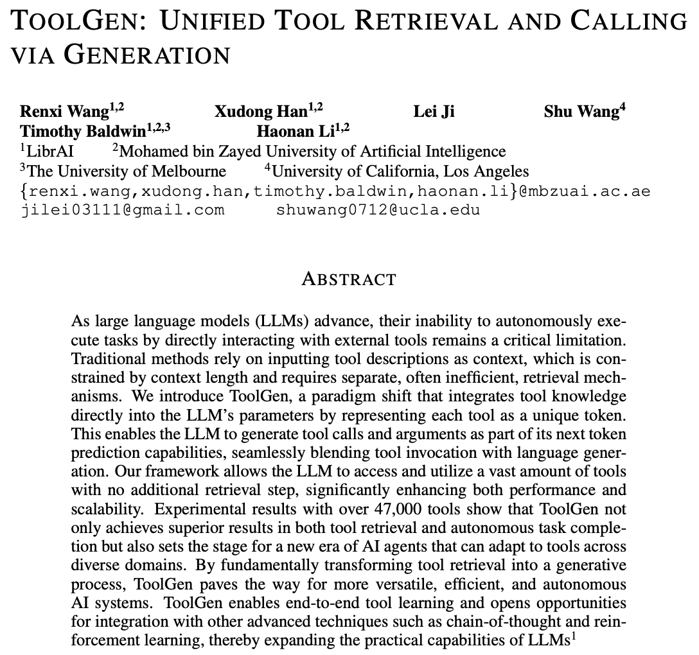

A [Tool Use](../../permanent/tool-use.md) paper, first released in October 2024, that represents each tool as a unique token in the LLM's vocabulary.

The usual approach is to put tool descriptions in the prompt, which is limited by context length and needs a separate retrieval step to pick which tools to include. ToolGen instead trains the tool knowledge into the model's parameters, so picking a tool and calling it are just part of next-token prediction. No separate retriever needed.

They test it with over 47,000 tools and report better results for both tool retrieval and completing tasks autonomously.

