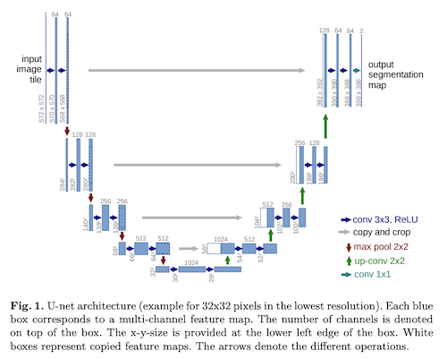

Notes from paper [U-Net: Convolutional Networks for Biomedical Image Segmentation](https://arxiv.org/abs/1505.04597) by Olaf Ronneberger, Philipp Fischer, Thomas Brox.

## Overview

Proposes an [Convolutional Neural Network](../../permanent/convolutional-neural-network.md) called [U-Net](U-Net) for biomedical [Image Segmentation](../../permanent/image-segmentation.md).

The U-Net architecture is characterised by its contracting path and expansive path. It effectively learns robust and invariant segmentations from limited training data.

The authors demonstrate the U-Net’s superior performance compared to prior methods on two challenging biomedical image segmentation tasks:
* neuronal structure segmentation in electron microscopic stacks
* cell segmentation in light microscopy images.

They utilise [Data Augmentation](../../permanent/data-augmentation.md) techniques, like elastic deformations, to enhance the network’s ability to generalise and handle variations in image data.
