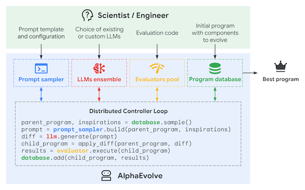

*My summary of the white paper from DeepMind: [AlphaEvolve: A coding agent for scientific and algorithmic discovery](https://storage.googleapis.com/deepmind-media/DeepMind.com/Blog/alphaevolve-a-gemini-powered-coding-agent-for-designing-advanced-algorithms/AlphaEvolve.pdf) by Alexander Novikov, Ngân Vu, Marvin Eisenberger, Emilien Dupont, Po-Sen Huang, Adam Zsolt Wagner, Sergey Shirobokov, Borislav Kozlovskii, Francisco J. R. Ruiz, Abbas Mehrabian, M. Pawan Kumar, Abigail See, Swarat Chaudhuri, George Holland, Alex Davies, Sebastian Nowozin, Pushmeet Kohli and Matej Balog*

You may have heard of DeepMind's new whitepaper about their coding agent, AlphaEvolve. It discovered a new algorithm for multiplying matrices, improving a 56-year-old solution, and many other mathematical problems, including optimising Google's internal infrastructure scheduling algorithms.

AlphaEvolve builds on DeepMind's 2023 work called FunSearch, where the basic idea is to continuously improve LLM-generated solutions to problems expressed as programs (i.e. code gen), re-prompting with previously-generated solutions selected using an evolutionary algorithm. At a high level:

1. Start with a prompt describing a problem, including a code base skeleton, with markers to show where the LLM should modify the code (**EVOLVE-BLOCK START** / **EVOLVE-BLOCK END**)
2. Use an evaluation function that assesses the solution's correctness and measures other properties, such as runtime, simplicity, num operations, etc.
3. Create a program database, which can start empty or be seeded with known solutions.
4. Sample programs from the database, using an evolutionary selection strategy based on island models (see below).
5. Instruct a set of LLMs to generate new programs to improve the evaluation metrics.
6. Now evaluate the results (using a lot of $ worth of distributed computation), and store the most promising programs.
 7. Repeat 5-6 until you have SOTA result.

The sampling algorithm is based on prior work on evolutionary algorithms (MAP-Elites and island models):

* Solutions are clustered into "islands" based on performance characteristics.
* Programs in islands evolve independently from other islands, and high-performance programs are selected as parents.
* The LLM plays the breeder role, generating offspring programs by generating new programs seeded from the parents.
* Information flows between the islands by "culling" the worst programs in the islands, replacing them with the best programs from the surviving islands

The main improvements on FunSearch are that a) it can evolve an entire codebase, not just a single function, and b) they have access to more powerful LLMs, from PaLM2 to Gemini Flash/Pro 2.0. Presumably, even more improvements can be made by utilising the latest generation of Gemini models (2.5 Pro, etc).

One interesting detail is that the open problems were suggested by mathematicians Javier Gomez Serrano and Terence Tao, who also helped formulate them as inputs. So, in a way, this might be the first example of vibe-coded mathematical discoveries.

Discussion on [Linkedin](https://www.linkedin.com/feed/update/urn:li:activity:7328934233345798144/).
