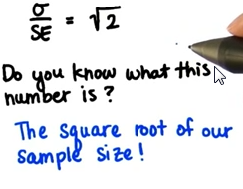

# Lesson 7: Sampling Distributions

* Usually refers to distribution of sample means of size n
* How can we compare one sample to other samples?
    * By comparing the mean of a sample to other means
* When taking a sample from population, expected value = mean of population
* Ratio of population std dev to SE (sample error) is sqrt(sample_size)
</img>
    * Therefore, SE = (pop_standard_deviation / sqrt(sample_size)) 
* Central Limit Theorem
</img>
    * given any population shape, if you take a sample from it and calculate the mean enough times, you'll get a normal distribution
* Importance of knowing shape of sampling distribution?
