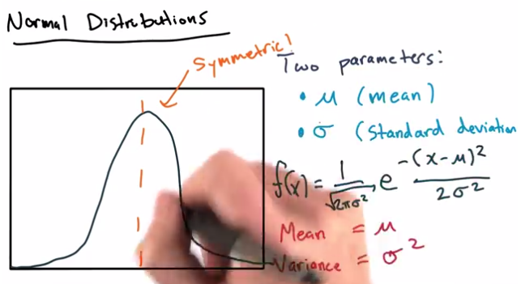

# Lesson 3 - Data Analysis

* Statistical Rigor
    * Significance test
        * How confident are we that a sample of data can prove or disprove an assumption?
    * "Formalized framework for comparing and evaluating data"
* Running statistical significance tests
    * Many test make assumptions about data's distribution
* Normal Distributions
    * Two parameters
        * Mean (mu)
        * Std (sigma)
    * Variance = sigma^2

</img>

* t-test
    * specified in terms of a "test statistic"
    * a number that helps to decide whether to accept or reject the null hypothesis
