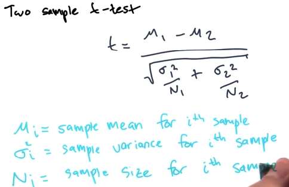
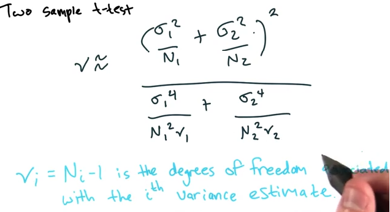

# Lesson 3 - Data Analysis

* Statistical Rigor
    * Significance test
        * How confident are we that a sample of data can prove or disprove an assumption?
    * "Formalized framework for comparing and evaluating data"
* Running statistical significance tests
    * Many test make assumptions about data's distribution
* Normal Distributions
    * Two parameters
        * Mean (mu)
        * Std (sigma)
    * Variance = sigma^2

</img>

* null hypothesis
    * statement to 'disprove' or reject with a test
* Welch's T-test
    * Used for comparing two samples which don't necessarily have the same sample size
    * Formula:
        
    </img>

    * Calculate degrees of freedom (aka nu) 

    </img>

    * Once you have t and nu, you can calculate p-value
        * "p == probability of obtaining the t-statistic as extreme as the one observed, if null was true"
