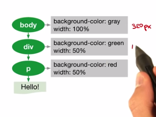

# Lesson 1: The Critical Rendering Path

* Critical Rendering Path is what actually converts HTML, CSS and JS into pixels on the screen
	* Steps:
		1. DOM - Build Document Object Model using HTML
		2. CSSOM - Fetch CSS and build CSS Object Model
		3. Render Tree - Combine DOM and CSSOM
		4. Layout - work out where everything goes on the page
		5. Paint - actually paint the pixels on the screen

* Converting HTML to DOM
	* Builds a set of tokens eg ```StartTag: html```, ```StartTag: head```
	* Then, a process consumes the tokens and converts them into nodes with properties
	* Lastly, the DOM is constructed by linking the objects together into a tree structure

* Building DOM is an incremental process
	* Your server can return incremental HTML to enhance performance

* CSSOM
	* Child of parent nodes inherit their parent's rules (hence 'cascading')
	* This means that you need to ensure all CSS styles are downloaded before rendering them. In other words: CSS is render blocking
	* Less specific rules are faster to render

* Render Tree
	* Combines the DOM and the CSSOM into a single tree

* Layout
	* The ```viewport``` meta tag represents the device width.
		* When set, a % width the body element will refer to the percentage of the device's screen
		* If not set, the width will default to 980px (usually)
	* If you set body to ```width: 100%``` any divs underneath it will inherit that size. If you set a div underneath it to ```width: 50%``` the div will be 50% of the body width.

	</img>

	* The *Layout* step is rerun when a window is resized, or device orientation is changed.
