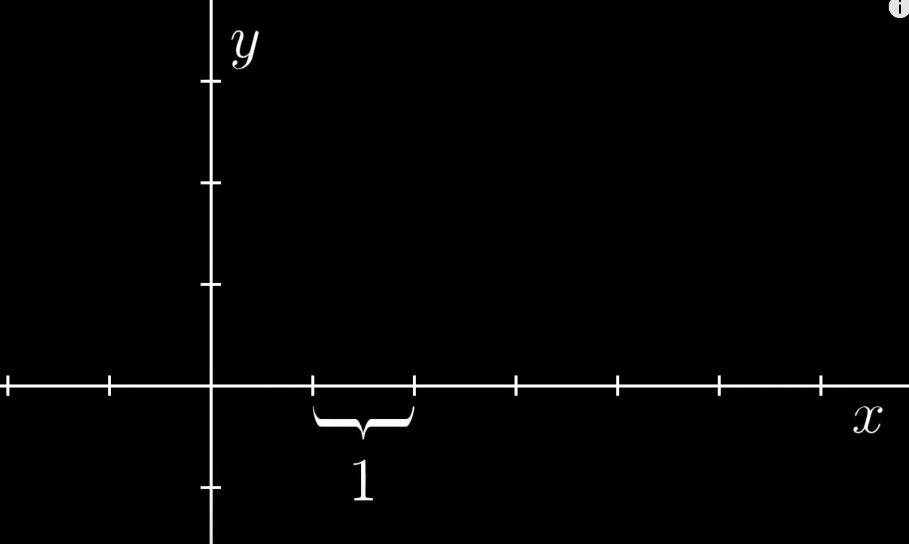
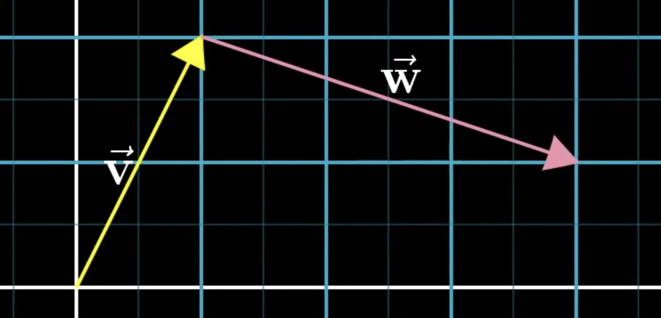

Link: https://www.youtube.com/playlist?list=PLZHQObOWTQDPD3MizzM2xVFitgF8hE_ab
Title: [[Essence of linear algebra]]
Author: [[3Blue1Brown]]
Type: #videoseries
Topics: [[maths]] [[linear algebra]]
---

# Essence of linear algebra
## 1. Vectors, what even are they?
* Vectors the building block for all of linear algebra.
* 3 distinct perspectives of vectors
    * Physics student
        * Arrows pointing in space defined by a length & direction.
    * Computer scientist (or data scientist)
        * An orderer list of numbers.
        * Example, a house can be model as the vector: `[square footage, sale price]`
    * Mathematician
        * A vector can be anything that has a notion of adding 2 together and multiplying vector by a number.
        
* In Linear Algebra, the vector is nearly always rooted in the origin, which is the place that the x and y intersects on the coordinate system.

    
* 2d coordinate system refresher
    * Has a horizontal line called x-axis
    * Have a vertical line called the y-axis
    * Place where they intersect is called "origin"
         
        * Can be thought of as center of space and root of all vectors.
    * An arbitrary length is chosen to represent 1 then tick marks are created on each axis representing this distance
        
* Coordinates of vector are a pair of numbers that "gives instructions" on how to get from the origin to its tip
    
        * 1. First number describes how far to walk along x-axis.
        * 2. 2nd number describes how far along the y-axis.
* Vectors are be distinguised from points by writing them vertically using square bracket notation.
* In 3d, an additional axis is drawn that's perpendicular to the other axises, adding a 3rd coordinate
    
* [[vector addition]]  from the physics perspective:
    * 1. First draw both vectors:
    
    * 2. Move the 2nd vector up to the tip of the first vectors tail:
    
    * 3. Draw a vector from the tail of the first to the tip of the 2nd vector: thenew vector is the sum.
    
* The above definition of vector addition is an extension to how kids are taught to add numbers using the number line:

* The same operation written from the computer scientist perspective:
$$ \begin{bmatrix} 1 \\ 2 \end{bmatrix} + \begin{bmatrix} 3 \\ -1 \end{bmatrix} = \begin{bmatrix} 1 + 3 \\ 2 + -1 \end{bmatrix} = \begin{bmatrix} 4 \\  1\end{bmatrix}$$

* [[vector multiplication]] is when you multiply a vector by a number, either stretching or squishing the vector based on that number.
    
    * Often referred to as "scaling the vector"
    * Hence number in this context is called a "scalar"
    * Computer science perspective:
    $$ 2 \begin{bmatrix} 1 \\ 2 \end{bmatrix} = \begin{bmatrix} 2 * 1 \\ 2 * 2 \end{bmatrix} = \begin{bmatrix} 2 \\ 4 \end{bmatrix}$$