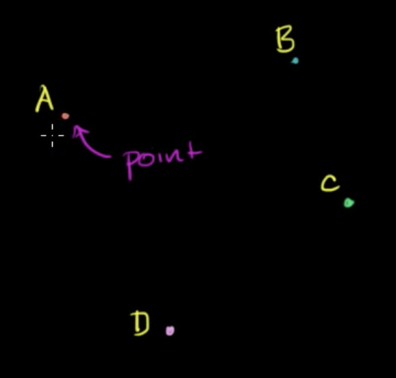
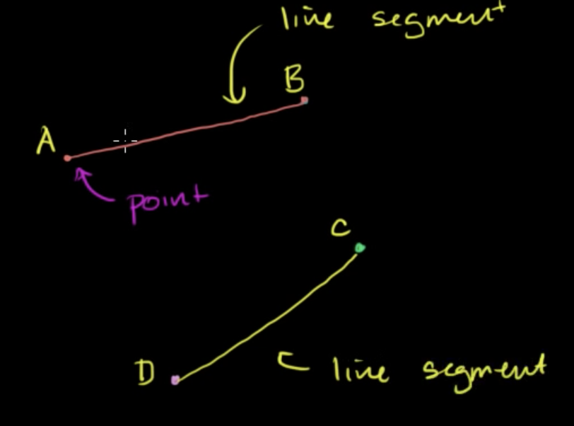
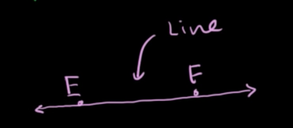
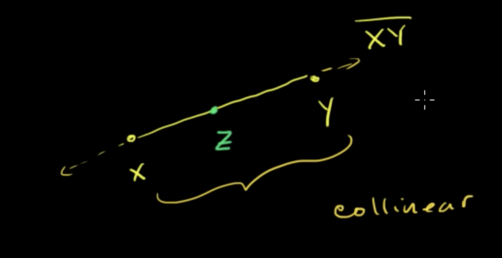

Link: https://youtu.be/il0EJrY64qE
Title: [[Basic geometry: language and labels]]
Author: [[Salman Khan]]
Type: #video
Topics: [[maths]] [[geometry]]

# Basic geometry: language and labels

* Word geometry is made up of 2 components: "geo" and "metry":
    * "Geo" - earth
    * "metry" - measurement
    * Therefore, geometery is about how shapes and space (things we see) related to each other.
    
 ## Plane
 
* A [[plane]] is a flat surface that has 2 dimensions: width and height and goes on infinity in either direction.

## Point

* A [[point]] refers to a dot on that plane and is the most basic geometric idea.

    
    
    * [[points]] are commonly labelled using upper case letters: A, B, C, D etc

    * A [[point]] is said to be 0-dimension: it doesn't provide any direction information.
    
## Line Segment

* A line that connects 2 points, is refered to as a [[line segment]]

    
    
    * A [[line segment]] is described using its endpoints: the [[point]]s that it is connected by.
    * In math notation, a line is drawn over the endpoints to denote that it's a line segment.

        $$\overline{AB}$$

    * The endpoints of a [[line segment]] can be inversed:

        $$\overline{AB} = \overline{BA}$$

    * A [[line segment]] is one-dimension - you can move back and forth along it.

## Ray

* A line that starts from one point that continues on infinitely in one direction is called a [[ray]]

    

    * The order of a ray is meaninful, unlike a line segment, as it describes the direction of the ray:

        $$\overrightarrow{AB} \neq \overrightarrow{BA}$$

     * The starting [[point]] is referred to the [[endpoint]]

## Line
 * A line that continues infinitely in either direction is formally called a [[line]].
 
     
    
     * A [[line]] is described by the endpoints it intersects, typically in alphabetical order though the order does not matter.

        $\overleftrightarrow{AB} = \overleftrightarrow{BA}$

## Collinear points
* If you have a line segment and introduce a point in the middle, you could describe all 3 points as "[[collinear]]" - they sit on the same line.

    

* In the above picture, if the distance between $XZ$ was the same as the distance between $ZX$, then you would refer to Z as the [[midpoint]] of the line segment $XY$.